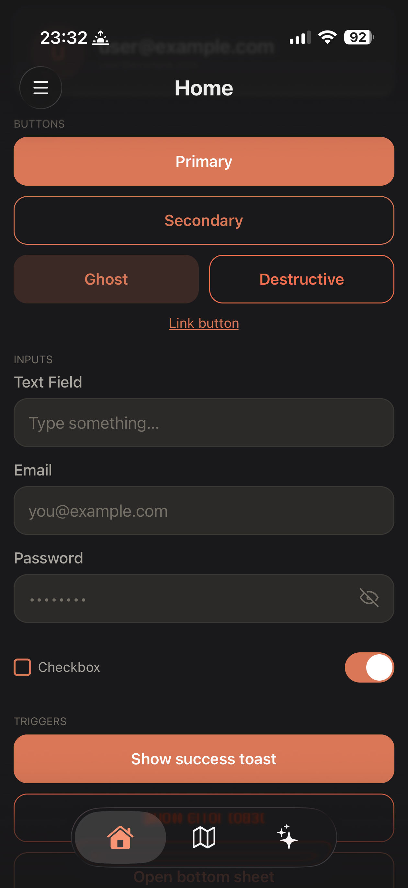
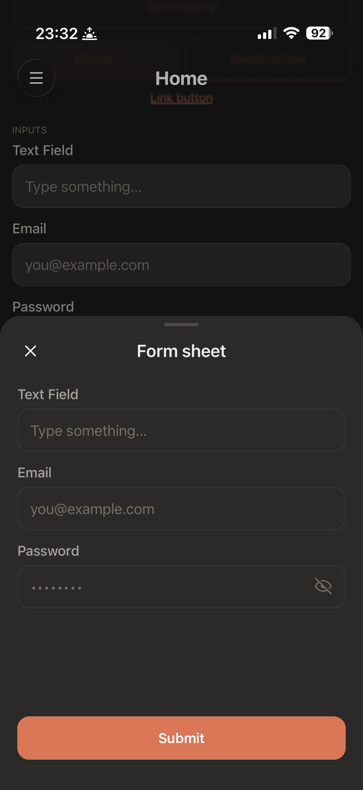
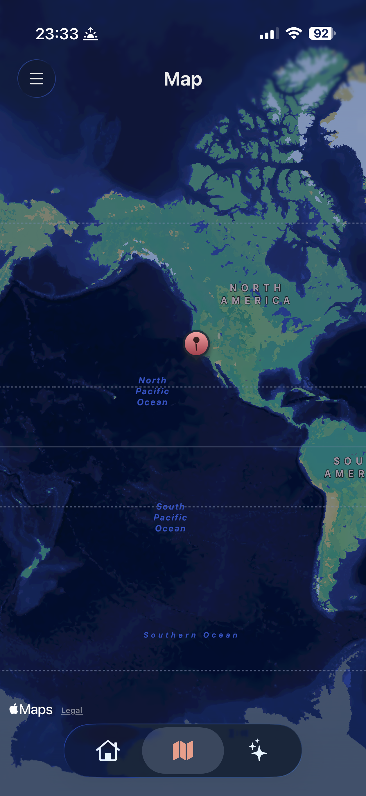
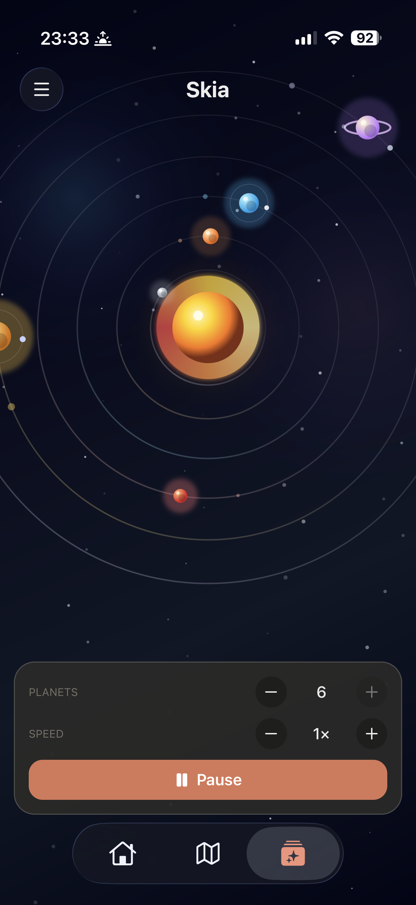
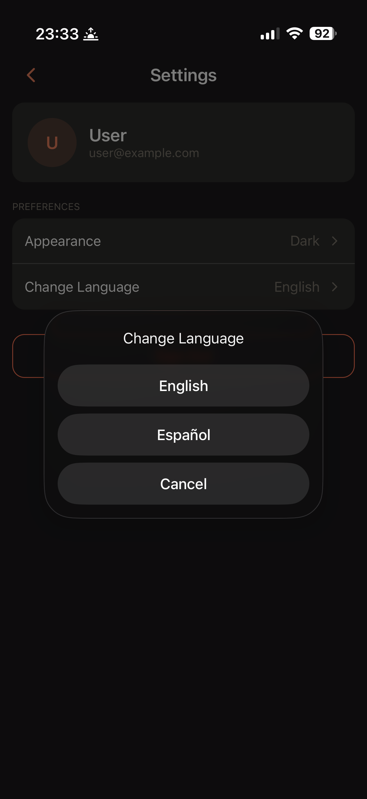

# Skeleton

Production-shaped Expo starter kit for shipping real mobile apps without spending the first week wiring auth, routing, storage, themes, forms, tests, and build plumbing.

Skeleton is an opinionated Expo 55 / React Native 0.83 template with the boring-but-critical app infrastructure already in place: Supabase auth, Expo Router app shells, NativeWind UI primitives, React Query, Zustand + MMKV persistence, Sentry, i18n, maps, Skia demos, CI, EAS profiles, and a small component playground you can fork into a product.

<p>
  
  
  
  
  
</p>

## What You Get

| Layer | Included |
| --- | --- |
| App shell | Expo Router route groups for auth and authenticated app flows, drawer navigation, bottom tabs, guarded redirects, splash handling |
| Auth | Supabase email/password, Google, Apple, password reset, recovery deep links, persisted auth state |
| UI kit | NativeWind components for buttons, text fields, auth fields, cards, avatars, list rows, skeleton pulse, toasts, bottom sheets, keyboard-aware layouts |
| State | TanStack React Query for server state, Zustand for client state, MMKV-backed persistence |
| Platform | React Native Maps, Shopify Skia demo, haptics, network status toasts, safe areas, gesture handler, keyboard controller |
| Product basics | Dark/light/system theme switching, i18next language wiring, Sentry error boundary + navigation integration |
| Quality | TypeScript, ESLint, Prettier, Jest, React Native Testing Library, duplication checks, GitHub Actions |
| Delivery | EAS development/production profiles, runtime version policy, update URL wiring, app identity resolved from env |

## Tech Stack

- **Expo 55**, **React Native 0.83**, **React 19**, **TypeScript**
- **Expo Router** for file-based native navigation
- **NativeWind** + Tailwind tokens for styling
- **Supabase** for auth and session lifecycle
- **TanStack React Query** for server state
- **Zustand** + **react-native-mmkv** for local state and persistence
- **@gorhom/bottom-sheet**, **React Native Gesture Handler**, **Reanimated**, **Keyboard Controller**
- **React Native Maps**, **Shopify React Native Skia**
- **Sentry**, **i18next**, **Zod**
- **Jest** + **React Native Testing Library**
- **EAS Build / Update**, GitHub Actions, Maestro-ready e2e script

## Quick Start

Prerequisites:

- Node.js LTS
- Yarn Classic v1 (`packageManager` is `yarn@1.22.1`)
- Xcode and/or Android Studio for native dev-client runs
- A local `.env` file for app identity, Supabase, OAuth, maps, EAS, and Sentry values

Install dependencies and start Metro:

```bash
yarn
yarn start
```

Run a native dev client in another terminal after native projects exist:

```bash
yarn ios
# or
yarn android
```

First run, or after native dependency/config changes:

```bash
yarn ios:rebuild
# or
yarn android:rebuild
```

`yarn start` runs `expo start --dev-client`, so this template expects a custom dev client rather than Expo Go-only development.

## Environment

Configuration is split between `app.json`, `app.config.ts`, `env.rules.json`, and your uncommitted root `.env`.

The app reads public build-time values through `EXPO_PUBLIC_*`. `env.rules.json` controls which variables must be non-empty when `EXPO_PUBLIC_NODE_ENV=production`, with separate maps for client runtime env and app config env.

Core variables:

| Variable | Purpose |
| --- | --- |
| `EXPO_PUBLIC_APP_NAME` | App display name override |
| `EXPO_PUBLIC_APP_SLUG` | Expo slug override |
| `EXPO_PUBLIC_APP_SCHEME` | Deep link / OAuth scheme |
| `EXPO_PUBLIC_IOS_BUNDLE_ID` | iOS bundle identifier |
| `EXPO_PUBLIC_IOS_BUNDLE_ID_TESTING` | Optional testing bundle id |
| `EXPO_PUBLIC_ANDROID_PACKAGE` | Android package id |
| `EXPO_PUBLIC_ANDROID_PACKAGE_TESTING` | Optional testing package id |
| `EXPO_PUBLIC_SUPABASE_URL` | Supabase project URL |
| `EXPO_PUBLIC_SUPABASE_PUBLISHABLE_KEY` | Supabase anon / publishable key |
| `EXPO_PUBLIC_GOOGLE_WEB_CLIENT_ID` | Google Sign-In web client id |
| `EXPO_PUBLIC_GOOGLE_IOS_CLIENT_ID` | Google Sign-In iOS client id |
| `GOOGLE_MAPS_API_KEY_ANDROID` | Android maps key |
| `GOOGLE_MAPS_API_KEY_IOS` | iOS maps key |
| `EXPO_PUBLIC_SENTRY_DSN` | Optional Sentry DSN |
| `EXPO_PUBLIC_EAS_PROJECT_ID` | EAS project id and Updates URL |
| `EXPO_PUBLIC_EAS_OWNER` | Expo account owner |
| `APPLE_TEAM_ID` | Apple Developer Team ID |
| `EXPO_PUBLIC_NODE_ENV` | `development`, `testing`, or `production` |
| `EXPO_PUBLIC_ENABLE_DEV_MODE` | Enables dev-mode behavior |

Skeleton does not ship a backend. Create your own Supabase project, add OAuth providers, and configure redirect URLs to match your app scheme and production domains.

## Project Map

| Path | Role |
| --- | --- |
| `src/app` | Expo Router routes only: auth group, app group, drawer, tabs, per-screen route files |
| `src/screens` | Screen composition and orchestration |
| `src/components/shared` | Reusable UI primitives and form pieces |
| `src/components/auth` | Auth screen/form composition |
| `src/components/drawer` | Drawer content and menu trigger |
| `src/api/auth` | Auth facade over Supabase and OAuth helpers |
| `src/api/supabase` | Supabase client and deep-link helpers |
| `src/api/db` | Data/repository error boundaries |
| `src/hooks` | Auth, splash, toasts, haptics, network, app-state, and navigation hooks |
| `src/store` | Zustand stores and persisted theme state |
| `src/storage` | MMKV instances and typed storage wrapper |
| `src/theme` | Color tokens and NativeWind theme vars |
| `src/translations` | i18next setup and language JSON |
| `src/utils` | Validators, error helpers, Sentry helpers, test utilities |
| `src/metro` | Metro-only shims |

`src/types` and `src/features` are reserved conventions for larger products. Add them when a domain grows beyond screens plus API boundaries.

## Starter Screens

- **Welcome / Sign in / Sign up / Forgot password / Reset password**: Supabase auth flows with shared credential fields and provider buttons.
- **Home**: UI playground for buttons, text inputs, auth fields, checkbox, switch, toasts, and bottom sheets.
- **Map**: React Native Maps example with a marker and app-configured platform keys.
- **Skia**: Animated solar-system canvas with speed, pause, and planet controls.
- **Settings**: Profile summary, language picker, theme picker, and sign out.

## Scripts

| Command | Use |
| --- | --- |
| `yarn start` | Start Expo dev server for a dev client |
| `yarn run check` | Project gate: TypeScript, ESLint, Prettier, Jest |
| `yarn lint:ts` | TypeScript check |
| `yarn lint:js` | ESLint |
| `yarn lint:format:check` | Prettier check |
| `yarn test` | Jest tests under `src`, with `TZ=UTC` |
| `yarn duplication:check` | jscpd copy/paste report |
| `yarn ios` / `yarn android` | Run native app after native projects exist |
| `yarn ios:rebuild` / `yarn android:rebuild` | Prebuild then run |
| `yarn test-e2e` | Run Maestro flows from `e2e/*.yaml` |
| `yarn eas-ios` / `yarn eas-android` | Development EAS builds |
| `yarn eas-ios:prod` / `yarn eas-android:prod` | Production EAS builds |
| `yarn eas-update:prod` | Production EAS update |
| `yarn eas-deploy:preview` / `yarn eas-deploy:prod` | EAS web deploy commands |
| `yarn nuke` | Destructive deep clean for dependencies/native artifacts |

Important Yarn 1 footnote: `yarn check` is Yarn's built-in lockfile/node_modules validator. For this template's lint + test gate, use `yarn run check`.

## Testing And CI

- Unit and component tests use Jest + React Native Testing Library.
- Test setup lives in `src/utils/test-utils/setup.ts`.
- Auth, env validation, screen, validator, and Skia config tests are included.
- GitHub Actions runs install, lint, tests, and duplication checks on pushes to `main` and manual dispatches.
- Maestro is wired as an optional e2e runner; add flows under `e2e/*.yaml`.

## Design Rules

Skeleton's code layout rules are intentionally boring: routes stay thin, screens orchestrate, shared components stay reusable, API modules hide vendor details, and stores own synchronous client state. The canonical rulebook lives in `.claude/rules/*.md`; start with `.claude/rules/core-architecture.md` before adding major product code.

Useful defaults:

- Put route files in `src/app`, but keep behavior in `src/screens`.
- Prefer shared UI in `src/components/shared` when a component is product-agnostic.
- Keep Supabase-specific logic behind `src/api/auth` and `src/api/supabase`.
- Use React Query for async/server state and Zustand for local synchronous state.
- Add i18n keys in every language file when user-visible copy changes.
- Run `yarn run check` before merging or tagging.

## Fork Checklist

After cloning or forking, replace the template identity with your product identity:

- Update `app.json` placeholders: app name, slug, scheme, iOS bundle id, Android package.
- Set `.env` values for Supabase, OAuth, maps, EAS, Apple team, Sentry, and production env requirements.
- Tune `env.rules.json` so production fails fast when required product config is missing.
- Confirm redirect URLs in Supabase for email recovery and OAuth callbacks.
- Replace app icon, splash, logo, and screenshots under `assets/png`.
- Rename `package.json` `name`; keep or remove `"private": true` based on your publishing needs.
- Update EAS owner/project values and build profiles for your release process.
- Add product screens under `src/screens` and route to them from `src/app`.

## License

[MIT](LICENSE). Use it, fork it, ship with it. Third-party dependencies keep their own licenses.
