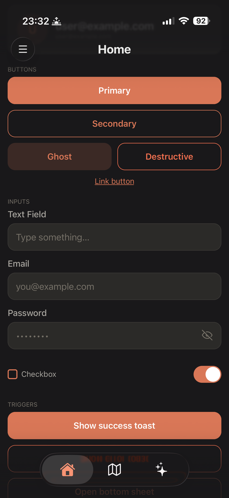
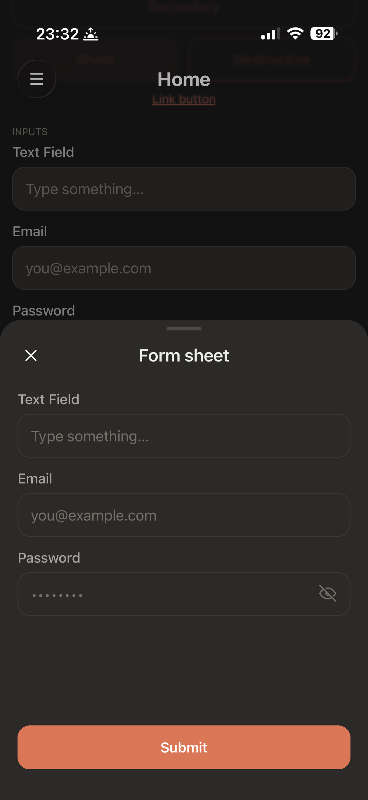
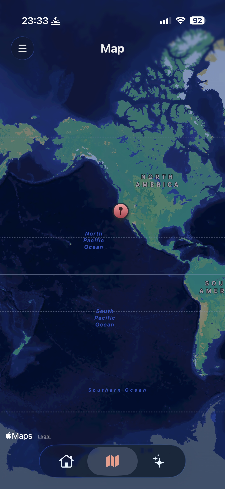
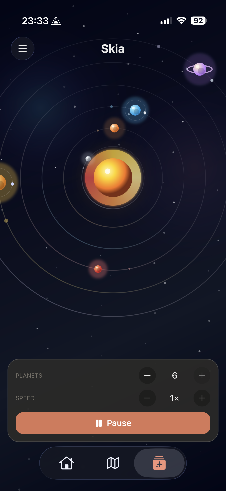
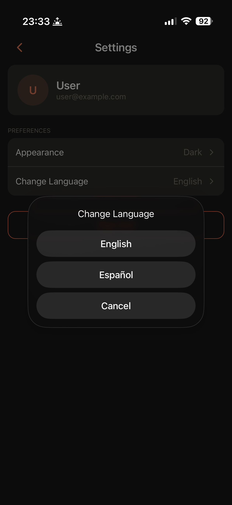

# Skeleton

Production-shaped Expo starter kit for shipping real mobile apps without spending the first week wiring auth, routing, storage, themes, forms, tests, and build plumbing.

Skeleton is an opinionated Expo 57 / React Native 0.86 template with the boring-but-critical app infrastructure already in place: Supabase auth, Expo Router app shells, NativeWind UI primitives, React Query, Zustand + MMKV persistence, Sentry, i18n, maps, Skia demos, CI, EAS profiles, and a small component playground you can fork into a product.

<p>
  
  
  
  
  
</p>

## What You Get

| Layer | Included |
| --- | --- |
| App shell | Expo Router route groups for auth and authenticated app flows, drawer navigation, bottom tabs, guarded redirects, splash handling |
| Auth | Supabase email/password, Google, Apple, password reset, recovery deep links, persisted auth state |
| UI kit | NativeWind components for buttons, text fields, auth fields, cards, avatars, list rows, skeleton pulse, toasts, bottom sheets, keyboard-aware layouts |
| State | TanStack React Query for server state, Zustand for client state, MMKV-backed persistence |
| Platform | React Native Maps, Shopify Skia demo, haptics, network status toasts, safe areas, gesture handler, keyboard controller |
| Product basics | Dark/light/system theme switching, i18next language wiring, Sentry error boundary + navigation integration, PostHog analytics (screens, typed events, Settings opt-out) and feature flags |
| Quality | TypeScript, ESLint, Prettier, Jest, React Native Testing Library, duplication checks, GitHub Actions |
| Delivery | EAS development/production profiles, runtime version policy, update URL wiring, app identity resolved from env |

## Tech Stack

- **Expo 57**, **React Native 0.86**, **React 19**, **TypeScript**
- **Expo Router** for file-based native navigation
- **NativeWind** + Tailwind tokens for styling
- **Supabase** for auth and session lifecycle
- **TanStack React Query** for server state
- **Zustand** + **react-native-mmkv** for local state and persistence
- **@gorhom/bottom-sheet**, **React Native Gesture Handler**, **Reanimated**, **Keyboard Controller**
- **React Native Maps**, **Shopify React Native Skia**
- **Sentry**, **PostHog**, **i18next**, **Zod**
- **Jest** + **React Native Testing Library**
- **EAS Build / Update**, GitHub Actions, Knip, lint-staged pre-commit

## Quick Start

Prerequisites:

- Node.js 22.13+ (`.nvmrc`)
- Yarn 4 via Corepack (`corepack enable`; version pinned in `packageManager`)
- Xcode 26.4+ (SDK 57) and/or Android Studio (JDK 17) for native dev-client runs
- Docker (Docker Desktop on macOS) for the local backend
- Optional: a local `.env` (copy `.env.example`) for app identity, a hosted Supabase project, OAuth, maps, EAS, and Sentry

Install dependencies, start the local backend, then Metro:

```bash
yarn
yarn backend:start
yarn start
```

`yarn backend:start` runs Supabase in Docker (first run downloads images, a few minutes), points the app at it through `.env.local`, and seeds a dev user you can sign in with: the credentials are in `.env.e2e.example`. No cloud account is needed. `yarn backend:stop` stops it and switches the app back to the Supabase project in `.env`, if any.

Run a native dev client in another terminal after native projects exist:

```bash
yarn ios
# or
yarn android
```

First run, or after native dependency/config changes:

```bash
yarn ios:rebuild
# or
yarn android:rebuild
```

`yarn start` runs `expo start --dev-client`, so this template expects a custom dev client rather than Expo Go-only development.

## Environment

Configuration is split between `app.json`, `app.config.ts`, `env.rules.json`, and your uncommitted root `.env`.

The app reads public build-time values through `EXPO_PUBLIC_*`. `env.rules.json` controls which variables must be non-empty when `EXPO_PUBLIC_NODE_ENV=production`, with separate maps for client runtime env and app config env.

Core variables:

| Variable | Purpose |
| --- | --- |
| `EXPO_PUBLIC_APP_NAME` | App display name override |
| `EXPO_PUBLIC_APP_SLUG` | Expo slug override |
| `EXPO_PUBLIC_APP_SCHEME` | Deep link / OAuth scheme |
| `EXPO_PUBLIC_IOS_BUNDLE_ID` | iOS bundle identifier |
| `EXPO_PUBLIC_IOS_BUNDLE_ID_TESTING` | Optional testing bundle id |
| `EXPO_PUBLIC_ANDROID_PACKAGE` | Android package id |
| `EXPO_PUBLIC_ANDROID_PACKAGE_TESTING` | Optional testing package id |
| `EXPO_PUBLIC_SUPABASE_URL` | Supabase project URL |
| `EXPO_PUBLIC_SUPABASE_PUBLISHABLE_KEY` | Supabase anon / publishable key |
| `EXPO_PUBLIC_GOOGLE_WEB_CLIENT_ID` | Google Sign-In web client id |
| `EXPO_PUBLIC_GOOGLE_IOS_CLIENT_ID` | Google Sign-In iOS client id; `app.config.ts` also derives the iOS URL scheme from it (required for production native builds) |
| `GOOGLE_MAPS_API_KEY_ANDROID` | Android maps key |
| `GOOGLE_MAPS_API_KEY_IOS` | iOS maps key |
| `EXPO_PUBLIC_SENTRY_DSN` | Optional Sentry DSN |
| `EXPO_PUBLIC_POSTHOG_PROJECT_TOKEN` | Optional PostHog project token (`phc_…`, public). Unset = analytics and feature flags disabled |
| `EXPO_PUBLIC_POSTHOG_HOST` | Optional PostHog ingestion host; defaults to `https://eu.i.posthog.com` (use `https://us.i.posthog.com` for US cloud) |
| `EXPO_PUBLIC_EAS_PROJECT_ID` | EAS project id and Updates URL |
| `EXPO_PUBLIC_EAS_OWNER` | Expo account owner |
| `APPLE_TEAM_ID` | Apple Developer Team ID |
| `EXPO_PUBLIC_NODE_ENV` | `development`, `testing`, or `production` |
| `EXPO_PUBLIC_ENABLE_DEV_MODE` | Enables dev-mode behavior |

### Backend

Development uses a local Supabase stack (`supabase/`, Docker):

| Command | What it does |
| --- | --- |
| `yarn backend:start` | Starts auth, database, REST and an email catcher (`http://127.0.0.1:54324`); `--full` adds Studio, storage and realtime. Writes the URL and publishable key to `.env.local` |
| `yarn backend:stop` | Stops the stack and removes the `.env.local` override |
| `yarn backend:reset` | Re-applies `supabase/migrations` and `supabase/seed.sql` (drops local data) |
| `yarn backend:types` | Regenerates `src/api/supabase/database.types.ts` |

- Schema lives in `supabase/migrations`. The `notes` table is a sample of a user-owned table with row level security; replace it with your own.
- `.env.local` outranks `.env`, also in local release builds. Run `yarn backend:stop` before building a release.
- The stack listens on all network interfaces with well-known local credentials. Stop it on untrusted networks.
- Physical devices can't reach `127.0.0.1` on your machine; use a simulator or emulator. On an Android emulator the dev app swaps `127.0.0.1` for `10.0.2.2` (the emulator's name for your machine) by itself.

For production, create your own Supabase project, push the migrations (`yarn supabase db push`), add OAuth providers, and configure redirect URLs to match your app scheme and production domains.

## Project Map

| Path | Role |
| --- | --- |
| `src/app` | Expo Router routes only: auth group, app group, drawer, tabs, per-screen route files |
| `src/screens` | Screen composition and orchestration |
| `src/components/shared` | Reusable UI primitives and form pieces |
| `src/components/auth` | Auth screen/form composition |
| `src/components/drawer` | Drawer content and menu trigger |
| `src/api/auth` | Auth facade over Supabase and OAuth helpers |
| `src/api/supabase` | Supabase client and deep-link helpers |
| `src/api/db` | Data/repository error boundaries |
| `src/api/analytics` | PostHog client, typed events (`trackEvent`), feature-flag registry |
| `src/hooks` | Auth, splash, toasts, haptics, network, app-state, and navigation hooks |
| `src/store` | Zustand stores and persisted theme state |
| `src/storage` | MMKV instances and typed storage wrapper |
| `src/theme` | Color tokens and NativeWind theme vars |
| `src/translations` | i18next setup and language JSON |
| `src/utils` | Validators, error helpers, Sentry helpers, test utilities |
| `src/metro` | Metro-only shims |

`src/types` and `src/features` are reserved conventions for larger products. Add them when a domain grows beyond screens plus API boundaries.

## Starter Screens

- **Welcome / Sign in / Sign up / Forgot password / Reset password**: Supabase auth flows with shared credential fields and provider buttons.
- **Home**: UI playground for buttons, text inputs, auth fields, checkbox, switch, toasts, and bottom sheets.
- **Map**: React Native Maps example with a marker and app-configured platform keys.
- **Skia**: Animated solar-system canvas with speed, pause, and planet controls.
- **Settings**: Profile summary, language picker, theme picker, and sign out.

## Scripts

| Command | Use |
| --- | --- |
| `yarn start` | Start Expo dev server for a dev client |
| `yarn check` | Project gate: all `lint:*` checks, then Jest (read-only, never rewrites files) |
| `yarn lint:ts` | TypeScript check |
| `yarn lint:js` | ESLint, fails on any warning |
| `yarn lint:format` | Prettier check |
| `yarn lint:unused` | Knip: unused files, dependencies, exports |
| `yarn fix` | Prettier write + ESLint `--fix` |
| `yarn test` | Jest tests under `src`, with `TZ=UTC` |
| `yarn test:coverage` | Jest with coverage report in `coverage/` |
| `yarn duplication:check` | jscpd copy/paste report |
| `yarn ios` / `yarn android` | Run native app after native projects exist |
| `yarn ios:rebuild` / `yarn android:rebuild` | Prebuild then run |
| `yarn eas-ios` / `yarn eas-android` | Development EAS builds |
| `yarn eas-ios:prod` / `yarn eas-android:prod` | Production EAS builds |
| `yarn eas-update:prod` | Production EAS update |
| `yarn eas-deploy:preview` / `yarn eas-deploy:prod` | EAS web deploy commands |
| `yarn nuke` | Destructive deep clean for dependencies/native artifacts |

## Testing And CI

- Unit and component tests use Jest + React Native Testing Library.
- Test setup lives in `src/utils/test-utils/setup.ts`.
- Auth, env validation, screen, validator, and Skia config tests are included.
- Pre-commit (husky + lint-staged) runs ESLint `--fix`, Prettier, then a project-wide `tsc` on staged JS/TS; commit messages go through commitlint.
- GitHub Actions (`lint-and-test.yml`) runs on pull requests, pushes to `main`, and manual dispatch: ESLint, TypeScript, Prettier, Knip, Jest with a coverage summary, jscpd, and commitlint over the PR's commits. Node version comes from `.nvmrc`.
- Knip config (`knip.jsonc`) lists the starter dependencies the template ships without using them yet; drop the ones your app doesn't need.

## Design Rules

Skeleton's code layout rules are intentionally boring: routes stay thin, screens orchestrate, shared components stay reusable, API modules hide vendor details, and stores own synchronous client state. The canonical rulebook lives in `.claude/rules/*.md`; start with `.claude/rules/core-architecture.md` before adding major product code.

Useful defaults:

- Put route files in `src/app`, but keep behavior in `src/screens`.
- Prefer shared UI in `src/components/shared` when a component is product-agnostic.
- Keep Supabase-specific logic behind `src/api/auth` and `src/api/supabase`.
- Use React Query for async/server state and Zustand for local synchronous state.
- Add i18n keys in every language file when user-visible copy changes.
- Run `yarn check` before merging or tagging.

## Fork Checklist

After cloning or forking, replace the template identity with your product identity:

- Update `app.json` placeholders: app name, slug, scheme, iOS bundle id, Android package.
- Set `.env` values for Supabase, OAuth, maps, EAS, Apple team, Sentry, PostHog, and production env requirements.
- Analytics: create a PostHog project, set `EXPO_PUBLIC_POSTHOG_PROJECT_TOKEN` (and the host for US cloud) locally and in EAS env. Add events to `src/api/analytics/events.ts` and flags to `featureFlags.ts` (then gate with `useFeatureGate`); delete the `template-demo` flag and the Home demo row. Analytics are on by default with a Settings opt-out; if you need opt-in consent (e.g. EU users), start the client opted out (`defaultOptIn: false`).
- Tune `env.rules.json` so production fails fast when required product config is missing.
- Confirm redirect URLs in Supabase for email recovery and OAuth callbacks.
- Rebrand icon and splash: edit `assets/brand/skull.svg` (any 24×24 stroke icon, e.g. from Lucide) and `assets/brand/brand.json` (gradient, splash color, icon size), regenerate with `scripts/generate-brand-assets.cjs` (see its header), then mirror `splashBackground` / `splashIconSize` in the `expo-splash-screen` entry of `app.json` (a test fails if they drift). Native rebuild required.
- Replace screenshots under `assets/png/screenshots`.
- Generate your own Android debug key with `./scripts/generate-debug-keystore.sh` (gitignored, stays on your machine; the shared React Native debug key's SHA-1 is usually already claimed in Google Cloud for common package names). Register its SHA-1 and the EAS keystore SHA-1 (expo.dev → Credentials → Android) as Android OAuth clients in the same Google Cloud project as `EXPO_PUBLIC_GOOGLE_WEB_CLIENT_ID`, or Android Google Sign-In fails with "Android clients and Web clients must be in the same project".
- Rename `package.json` `name`; keep or remove `"private": true` based on your publishing needs.
- Update EAS owner/project values and build profiles for your release process.
- Add product screens under `src/screens` and route to them from `src/app`.

## License

[MIT](LICENSE). Use it, fork it, ship with it. Third-party dependencies keep their own licenses.
