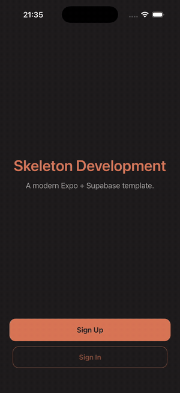
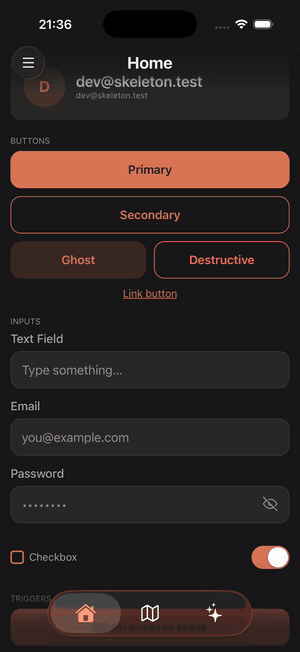
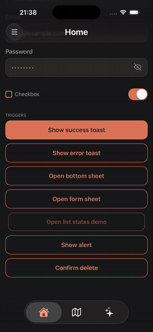
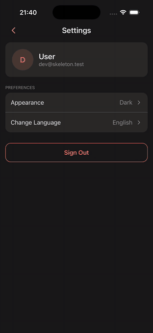
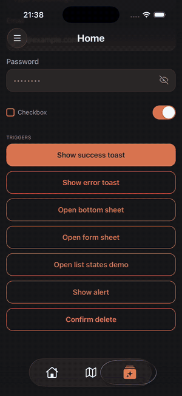
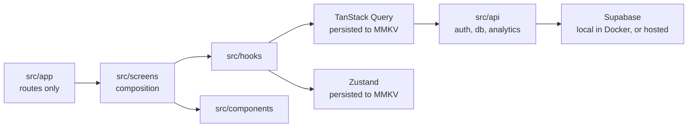

<p align="center">
  
</p>

<h1 align="center">Skeleton</h1>

<p align="center">
  An Expo template that goes from an empty folder to a signed-in app on a simulator<br/>
  with one command and no cloud accounts.
</p>

<p align="center">
  <a href="https://github.com/usotsukki/skeleton-rn/actions/workflows/lint-and-test.yml">
    
  </a>
  <a href="LICENSE"></a>
</p>

Skeleton is the app you would have after the first two weeks of a new project: auth, navigation, a themed component kit, offline-tolerant lists, analytics, crash reporting, tests, CI and release builds. The backend runs on your machine in Docker, so a new app works before you have created a single account, and an AI agent can build, sign in and test it without asking you for anything.

**Stack:** Expo SDK 57, React Native 0.86 (new architecture), React 19 with the React Compiler, TypeScript, Expo Router, NativeWind, TanStack Query and Form, Zustand, MMKV, Supabase, Skia, Reanimated, Sentry, PostHog, Jest, Maestro.

## Demo

| Sign in on the local backend | Components | List states |
| --- | --- | --- |
|  |  |  |
| **Theme and language** | **Skia** | |
|  |  | |

Recorded on an iOS simulator from a development build running against the local backend.

## Start a new app

Requires Node 22 with corepack, Docker, and Xcode 26.4+ for iOS or the Android SDK with JDK 17 for Android.

```bash
npx create-expo-app@latest my-app --template https://github.com/usotsukki/skeleton-rn --no-install
cd my-app
yarn
yarn rename "My App" my-app myapp com.company.myapp
yarn dev
```

| Step | What happens |
| --- | --- |
| `npx create-expo-app` | Copies the template into `my-app` and makes one initial commit. None of the template's history comes along. `--no-install` leaves the install to Yarn, which the lockfile is for |
| `yarn` | Installs dependencies with Yarn 4 (`corepack enable` provides it) |
| `yarn rename` | Sets the name, slug, URL scheme and bundle id in `package.json`, `app.json` and the local backend config |
| `yarn dev` | Starts the local backend, starts Metro on a free port, builds the native app and opens it. Pass `android` for the emulator |

Sign in with `dev@skeleton.test` and `local-dev-password`. That user exists only in the local backend.

The first `yarn dev` downloads the backend's Docker images and compiles the native app, which takes a few minutes. Later runs take seconds. `yarn dev:stop` stops Metro and the backend.

<details>
<summary>Other ways to get the code</summary>

| Goal | Command |
| --- | --- |
| A new GitHub repository with one initial commit | `gh repo create my-app --template usotsukki/skeleton-rn --private --clone` |
| The files only, with no git repository | `npx degit usotsukki/skeleton-rn my-app` |

Run `yarn` in the new folder, then continue with `yarn rename`. `yarn create expo-app` fails on a GitHub template URL (it resolves an old create-expo-app), so use `npx`.

</details>

## What is included

| Area | What you get |
| --- | --- |
| Auth | Email and password, Google, Apple, password reset through deep links, a persisted session, and errors shown inline in the form |
| Backend | Supabase with migrations, row-level security and generated TypeScript types. A sample `notes` table shows the pattern for user-owned data |
| Navigation | Expo Router with an auth group, a drawer and native bottom tabs. Signed-out users can't reach app screens |
| UI kit | Buttons, text fields, forms, cards, list rows, toasts, in-app alerts, bottom sheets and keyboard-aware layouts, in light and dark |
| Data | Lists that show cached data on a cold start and keep it on screen when a refresh fails. Requests time out and report to Sentry |
| Accessibility | Dynamic type, screen reader labels and AA contrast, checked by tests |
| Analytics | PostHog screen views, typed events, feature flags and a Settings opt-out. Without a project, events print to the console in development |
| Releases | EAS build and update profiles, Sentry source maps, and an environment check that fails a production build when configuration is missing |
| Languages | English and Spanish |

## How it works


```mermaid
flowchart LR
  Routes["src/app<br/>routes only"] --> Screens["src/screens<br/>composition"]
  Screens --> Hooks["src/hooks"]
  Screens --> UI["src/components"]
  Hooks --> Query["TanStack Query<br/>persisted to MMKV"]
  Hooks --> Stores["Zustand<br/>persisted to MMKV"]
  Query --> Api["src/api<br/>auth, db, analytics"]
  Api --> Supabase["Supabase<br/>local in Docker, or hosted"]
```

```txt
src/app          Expo Router routes and layouts
src/screens      screen composition
src/components   shared UI kit, auth forms, drawer
src/hooks        auth, toasts, alerts, feature flags, screen tracking
src/api          auth facade, Supabase client, repository errors, analytics
src/store        Zustand stores and the persist helper
src/env          every environment variable, validated with Zod
supabase         local backend config, migrations, seed user
maestro          end-to-end flows
```

- Route files stay thin. Screens compose, hooks hold behaviour, and only `src/api` talks to a vendor SDK.
- Environment variables are read in one place and validated at startup. A production build fails when a required value is missing.
- The app reaches the local backend through `.env.local`, which `yarn dev` writes. A production bundle that still points at your machine fails to build.
- Optional services stay out of the way until you configure them. Without a Sentry token the upload is skipped, without a Google client id the Google button is hidden, and without a PostHog token nothing is sent.

## Built for AI agents

The repository carries the rules, scripts and checks an agent needs to work without supervision.

| Piece | What it does |
| --- | --- |
| Rules in `.claude/rules` | Architecture, testing, debugging, git safety and which commands are safe to run |
| `yarn dev`, `yarn dev:stop` | One command to a running app, one to stop everything the agent started |
| Seeded local user | The agent signs in by itself. Hosted projects stay off limits unless you allow them |
| `yarn e2e:sign-in` | Maestro signs in on iOS or Android, confirms the app is on the local backend before typing, and fails fast when it can't run |
| `device-check` agent | Runs a described check on a simulator and returns a verdict with screenshots |
| `review-staged` skill | Sends each change to a second model for review before it is committed |
| Hooks | Block destructive git commands, hook bypasses and AI attribution in commits |

`AGENTS.md` is the entry point for tools other than Claude Code.

## Scripts

| Script | Runs |
| --- | --- |
| `yarn dev [ios\|android]` | Local backend, Metro and the native app |
| `yarn dev:stop` | Stops this project's Metro and the local backend |
| `yarn check` | Everything CI runs: types, ESLint, Prettier, Knip, then Jest |
| `yarn fix` | Prettier and ESLint autofix |
| `yarn test` | Jest in UTC |
| `yarn backend:reset` | Re-applies the migrations and the seed |
| `yarn backend:types` | Regenerates the database types after a migration |
| `yarn e2e:sign-in [--android]` | Maestro sign-in on the running simulator or emulator |
| `yarn rename` | Sets the app identity |

## Testing

- Jest and React Native Testing Library cover auth, forms, hooks, stores, screens, environment validation and theme colours: 250 tests, run with `TZ=UTC`.
- Tests never reach the network. A request that a test doesn't stub is rejected.
- Maestro drives the real app through sign-in on both platforms.
- Every pull request runs ESLint, types, Prettier, Knip, Jest with coverage, a duplication check and commitlint ([workflow](.github/workflows/lint-and-test.yml)).
- Pre-commit runs ESLint, Prettier and `tsc` on staged files, and commitlint on the message.

## Going to production

The local backend covers development. To ship, create a Supabase project, push the migrations with `yarn supabase db push`, and put its URL and key in `.env` and in your EAS environment. Add Sentry, PostHog, Google and Apple sign-in as you need them. [docs/new-app.md](docs/new-app.md) is the full checklist.

## Docs

| Doc | Covers |
| --- | --- |
| [new-app.md](docs/new-app.md) | Checklist from template to product: identity, brand, OAuth, analytics, EAS |
| [environment.md](docs/environment.md) | Every environment variable, the local backend commands and their limits |
| [core-architecture.md](.claude/rules/core-architecture.md) | Folder ownership and state rules |
| [testing.md](.claude/rules/testing.md) | Test setup, mocks and conventions |

## License

[MIT](LICENSE). Third-party dependencies keep their own licenses.
